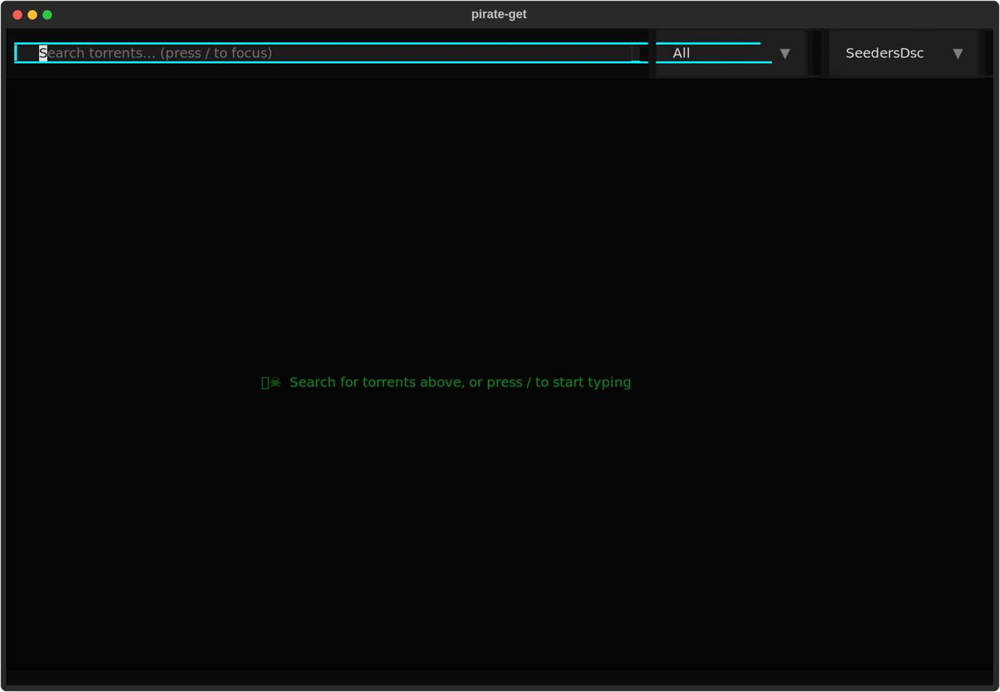
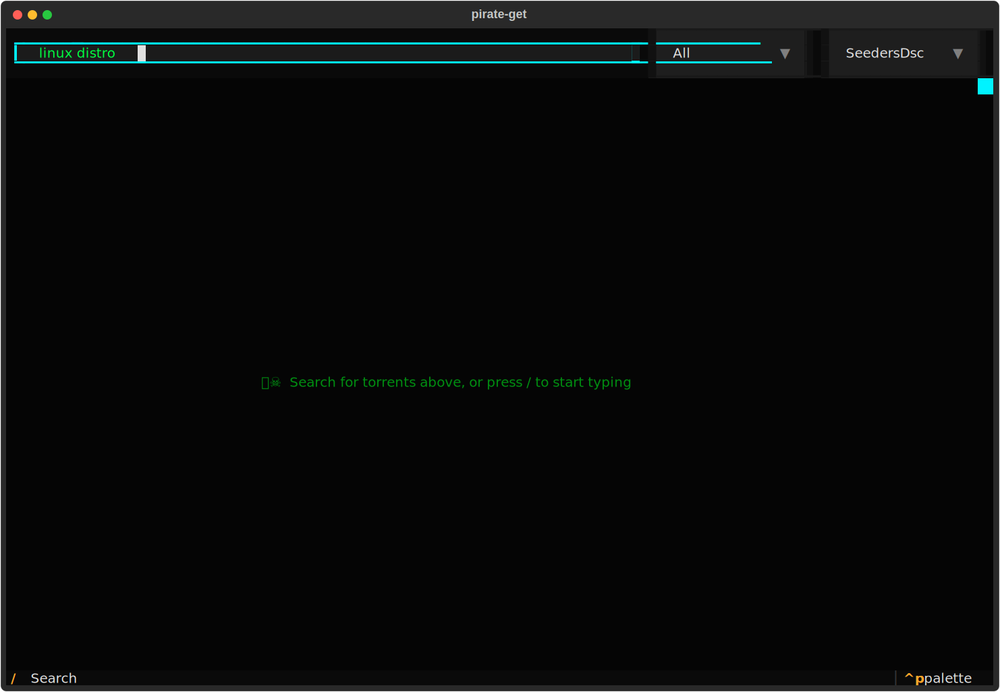

# pirate-get TUI

A modern, keyboard-driven terminal user interface for searching and downloading torrents.

## Screenshots

### Main Interface


### Search Results


## Features

- **Cyberpunk Theme**: Matrix green and cyber cyan color scheme
- **Card-Based Results**: Each torrent displayed as a visual card with all key info
- **Health Indicators**: Color-coded seeder health bars
  - Green: 50+ seeders (healthy)
  - Yellow: 10-49 seeders (moderate)
  - Red: <10 seeders (low)
- **Toast Notifications**: Action feedback in top-right corner
- **Detail Panel**: Expandable panel with full torrent metadata
- **Keyboard-First**: Navigate entirely with keyboard

## Keyboard Shortcuts

| Key | Action |
|-----|--------|
| `/` | Focus search input |
| `Enter` | Toggle detail panel |
| `j` / `k` | Move cursor down/up |
| `g` / `G` | Jump to top/bottom |
| `m` | Copy magnet link |
| `o` | Open in browser |
| `t` | Save .torrent file |
| `s` | Save .magnet file |
| `x` | Send to Transmission |
| `r` | Refresh search |
| `Esc` | Close detail/blur |
| `q` | Quit |

## Quick Start

### Launch TUI Mode

```bash
# With search term
pirate-get --tui "ubuntu"

# Interactive mode
pirate-get --tui
```

### Installation

```bash
# One-line install
curl -fsSL https://raw.githubusercontent.com/vidya-hub/pirate-get-tui/main/install.sh | bash

# Or via pip
pip install pirate-get
```

## Configuration

The TUI respects all standard pirate-get configuration options. Create `~/.config/pirate-get` with:

```ini
[Save]
directory = ~/Downloads

[Search]
total-results = 50

[Misc]
# Custom command for opening magnets
openCommand = vlc %s

# Transmission integration
transmission = true
transmission-auth = user:pass
```

## Theme

The TUI uses a "Cyber Pirate" color scheme:

| Element | Color |
|---------|-------|
| Background | `#050505` (deep black) |
| Primary Text | `#00ff41` (matrix green) |
| Accents | `#00f3ff` (cyber cyan) |
| Warnings | `#ffb700` (amber) |
| Errors | `#ff0055` (cyber pink) |

## Requirements

- Python 3.8+
- Textual 0.40.0+
- Terminal with Unicode support (most modern terminals)

## Architecture

```
pirate/
├── tui.py      # Main TUI application (PirateGetApp)
├── tui.tcss    # Textual CSS stylesheet
├── data.py     # Categories, sorts, mirrors
└── torrent.py  # Search API integration
```

### Custom Widgets

- `TorrentItem`: Card-style list item for each result
- `HealthBar`: Visual seeder health indicator

## Development

Run the TUI in development mode:

```bash
cd pirate-get
python -m pirate.tui
```

For hot-reloading during CSS development:

```bash
textual run --dev pirate/tui.py
```
